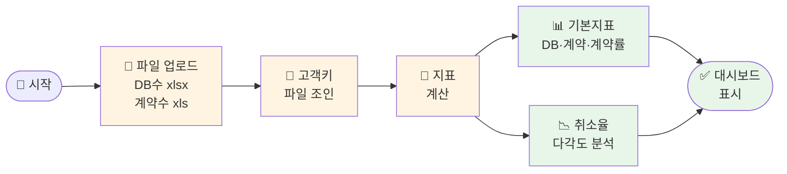

# 나의 워크샵 스킬 설계서

> 📋 **이 설계서는 [사전설문응답.md](사전설문응답.md) 인터뷰를 바탕으로 작성되었습니다.**

> ⚠️ **이 설계서는 초안입니다!**
> 
> 정답이 아니에요. 워크샵 당일 강사님과 함께 범위를 더 좁히거나, 더 구체화할 수 있습니다.
> 
> **사전과제의 목적**:
> 1. 스킬을 설치해서 한 번 써본 것 ✅
> 2. 나만의 스킬 설계서를 만들어서 "아, 내 작업이 이렇게 자동화되겠구나" 감 잡기 ✅
> 
> 이 정도면 충분해요! 나머지는 워크샵에서 함께 다듬어봐요 😊

## 목차
- [0. 선언](#0-선언)
- [한눈에 보기](#한눈에-보기)
- [Core (필수)](#core-필수)
- [Optional](#optional)
- [나중에 더 발전시킬 아이디어](#나중에-더-발전시킬-아이디어)

---

## 0. 선언

- **스킬 이름**: `db-performance-dashboard`
- **한 줄 설명**: CMS 로우 파일 2개를 업로드하면 DB수·계약수·취소율 등을 자동 분석해서 웹 대시보드로 보여준다
- **만드는 사람**: 영업관리실 DB분배 담당
- **스킬 유형**: [x] 파일 기반 &nbsp; [x] 웹 대시보드
- **MVP 목표**: "DB수 파일과 계약수 파일을 브라우저에 올리면, 기본 지표(DB수/계약수/계약률)와 취소율 분석이 차트와 표로 자동 표시된다"

---

## 한눈에 보기

### 외부 연동

없음 — 외부 서비스 연동 없이 바로 만들 수 있는 스킬이에요! 👍

### 워크플로 시각화

> 💡 **다이어그램이 안 보이나요?**
> VSCode에서 `Markdown Preview Mermaid Support` 확장 설치 후 미리보기(`Cmd+Shift+V`)로 확인하세요!

---

## Core (필수)

### 1. 언제 쓰나요?

**대표 상황**:
매일 CMS에서 DB수 파일(.xlsx)과 계약수 파일(.xls)을 다운받은 후, 기존에는 엑셀에서 수식으로 3~4시간 가공하던 성과 분석을 대시보드에 파일만 올려서 즉시 확인할 때

**왜 필요한가**:
- 매일 반복되는 엑셀 가공 작업에 3~4시간 소요
- 상급자 요청에 따라 분석 항목이 계속 추가됨
- 최상급자 보고 자료로도 활용되어 가시성/전문성 요구 높음

### 2. 사용법

**이렇게 부르면**:
- 브라우저에서 대시보드 페이지 열기
- DB수 파일(.xlsx) 업로드
- 계약수 파일(.xls) 업로드
- 자동으로 분석 결과 표시

**결과물 형태**: [x] 웹 대시보드 (차트 + 표)

**결과물 예시**:
> - 상단 KPI 카드: 총 DB수 1,243 / 계약수 187 / 계약률 15.0% / 취소율 8.6%
> - 탭1 기본지표: DB수·계약수·계약률 요약 테이블 + 바 차트
> - 탭2 취소율 분석: 기간별·개인별·팀별·센터별·사은품 전후 비교 차트

### 3. 입력/출력 명세

| 구분 | 내용 |
|------|------|
| **입력 파일 1** | `WM_고객관리_yyyy-mm-dd hhmmss.xlsx` (DB수 파일) |
| **입력 파일 2** | `신청자관리_yyyy_mm_dd_hh_mm_ss.xls` (계약수 파일) |
| **조인 키** | DB수 G열(고객키) ↔ 계약수 D열(고객키) |
| **취소 판단 기준** | 계약수 AQ열(반품일)에 날짜가 있으면 취소 |
| **매체/패키지 분류** | DB수 T열(매체코드) 기준 |
| **출력** | 브라우저 웹 대시보드 (차트 + 정렬 가능한 표) |

### 4. 범위

**하는 것**:
1. DB수 파일 + 계약수 파일을 고객키로 조인하여 기본 지표(DB수/계약수/계약률) 산출
2. 취소율 다각도 분석 (기간별 / 취소까지 소요일수 / 개인별 / 팀별 / 센터별 / 사은품 증정 전후 비교)
3. 차트(막대/라인)와 정렬 가능한 표로 시각화하여 웹 대시보드 표시

**안 하는 것**:
1. CMS 자동 로그인 및 파일 자동 다운로드 (수동 다운로드 후 업로드)
2. 분석 결과 자동 저장 또는 외부 공유 (브라우저에서 열람만)

### 5. 데이터/도구/권한

| 항목 | 내용 |
|------|------|
| **읽는 데이터** | 로컬에서 업로드한 .xlsx / .xls 파일 |
| **쓰는 위치** | 브라우저 메모리 (파일 저장 없음) |
| **외부 서비스** | 없음 |
| **민감정보** | 고객 이름·전화번호 포함 — 브라우저 내에서만 처리, 외부 전송 없음 |

### 6. 실패/예외 처리

**예상되는 실패 상황**:
1. DB수 파일과 계약수 파일의 고객키가 매칭되지 않는 경우 (날짜 범위 불일치 등)
2. 컬럼 위치가 바뀌거나 파일 형식이 변경된 경우
3. .xls 구형 포맷 파싱 오류

**실패 시 안내 원칙**:
- 매칭 건수와 미매칭 건수를 상단에 표시하여 데이터 정합성 확인 가능하게
- 컬럼 오류 시 "몇 번째 열을 읽지 못했어요" 메시지로 어느 파일이 문제인지 안내
- .xls 파싱 실패 시 ".xlsx로 다시 저장 후 업로드해주세요" 안내

### 7. 대화 시나리오

**정상 케이스**:

**나**: (DB수 파일, 계약수 파일 업로드)

**대시보드**:
> ✅ 파일 로드 완료!
> - DB수 파일: 1,243건
> - 계약수 파일: 312건 (매칭 완료: 298건)
> 
> [탭1 기본지표] [탭2 취소율 분석]

**실패 케이스**:

**나**: (계약수 파일 대신 다른 파일 업로드)

**대시보드**:
> ⚠️ 고객키 컬럼을 찾을 수 없어요.
> 계약수 파일(신청자관리_...)이 맞는지 확인해주세요!

### 8. 테스트 & 완료 기준

**테스트 체크리스트**:
- [ ] 두 파일 업로드 시 고객키 기준으로 정상 조인되는지 확인
- [ ] 기본 지표(DB수/계약수/계약률) 수치가 기존 엑셀 결과와 일치하는지 확인
- [ ] AQ열 반품일 기준으로 취소율이 정확히 계산되는지 확인
- [ ] 사은품(AB열+W열+X열) 증정 전후 취소율 비교가 표시되는지 확인
- [ ] 개인별·팀별·센터별 취소율 분류가 정상 동작하는지 확인

**Done 기준**:
"두 파일을 브라우저에 올리면 3분 안에 기본 지표와 취소율 분석이 차트와 표로 표시되고, 기존 엑셀 수치와 동일한 결과가 나온다"

---

## Optional

### A. 파일 기반

| 항목 | 내용 |
|------|------|
| **지원 형식** | .xlsx (DB수 파일), .xls (계약수 파일) |
| **DB수 파일 핵심 컬럼** | G(고객키), T(매체코드), I(분배일), J(유입일), H(OB명), U(패키지), AB(대표사은품), AD(고객상태) |
| **계약수 파일 핵심 컬럼** | D(고객키), N(담당자), AQ(반품일/취소기준), V(대표사은품), W(미배송사은품), X(사은품), BT(브랜드) |
| **조인 방식** | 고객키(G열↔D열) LEFT JOIN — DB수 기준으로 계약 여부 판단 |

### C. 다단계 워크플로우

**대시보드 탭 구성 (안)**:

1. **탭1 — 기본 지표**: DB수 / 계약수 / 계약률 요약 카드 + 일별 추이 차트
2. **탭2 — 취소율 분석**:
   - 기간별 취소율 추이
   - 취소까지 소요일수 분포 (몇 일 만에 취소했는지)
   - 개인별 / 팀별 / 센터별 취소율 랭킹 표
   - 사은품 증정 전후 취소율 비교 (대표사은품 AB열 기준)
3. **탭3 — 매체/패키지 분석**: T열 매체코드 기준 계약률 비교

---

## 나중에 더 발전시킬 아이디어

- [ ] 분배 예측 기능 — 과거 유입 패턴 기반으로 차주 DB수 예측
- [ ] 개인별 성과 상세 페이지 — 담당자 클릭 시 해당 상담원 상세 분석
- [ ] DB 계열별 성과 비교 — 0~5계열별 계약률/취소율 차이 분석
- [ ] 연령대별 / 체류시간별 계약률 분석 (L열, Y열 활용)
- [ ] 브랜드별(뇌새김/톡이즈) 성과 분리 분석 (BT열 활용)
- [ ] CMS 자동 로그인 + 파일 다운로드 자동화

---

## 배포 준비 (워크샵 후)

### 필요한 파일

| 파일 | 상태 | 설명 |
|------|------|------|
| `index.html` | [ ] 미완성 | 대시보드 메인 파일 (워크샵에서 작성) |
| `README.md` | [ ] 자동생성 예정 | 설치/실행 가이드 |

### 실행 방법 (VSCode)

워크샵에서 완성 후, VSCode에서:
1. `db-performance-dashboard` 폴더 열기
2. `index.html` 우클릭 → `Open with Live Server`
3. 브라우저에서 파일 업로드 후 대시보드 확인

---

**워크샵 당일 이 설계서 가져오세요!**